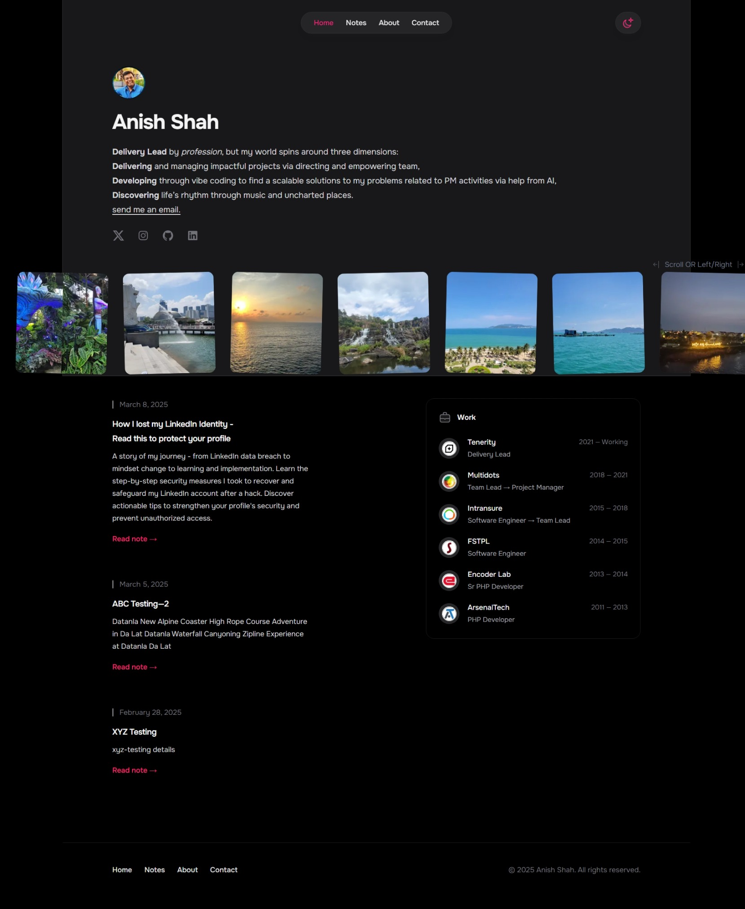

# Anish Shah - Personal website built using Next.js and Notion as headless CMS (Original by Bartosz Jarocki)

This is my personal website I have forked originally built using

- [TypeScript](https://www.typescriptlang.org/)
- [Next JS](https://nextjs.org/)
- [Notion API](https://developers.notion.com/)
- [Next Themes](https://github.com/pacocoursey/next-themes)
- [Tailwind CSS](https://tailwindcss.com)
- [NextSEO](https://github.com/garmeeh/next-seo)
- [Vercel OG](https://vercel.com/docs/concepts/functions/edge-functions/og-image-generation)

## Running locally

To run application locally few environment variables have to be defined (in `.env.local`):

1. `NEXT_PUBLIC_URL` - used to create absolute urls, for example canonical links and open graph images
2. `NOTION_TOKEN` - used by Notion API client, nore info [here](https://developers.notion.com/docs/authorization)
3. `NOTION_DATABASE_ID` - used to fetch notes/blog post list

There's a certain data format of Notion database that's needed by application. When fetching the database content, application expects the following properties to be configured in the database:

1. `id`
2. `created_time`
3. `last_edited_time`
4. `cover`
5. `hashtags`
6. `title`
7. `description`
8. `slug` - used as a notes slug for example in `/notes/hello-world` the slug would be `hello-world`
9. `published` - used to filter unpublished notes from available notes list
10. `publishedAt`
11. `inProgress` - used to display `Work in progress` badge on in the notes list

Here's how the database in Notion should look like:


After defining environment variables and your Notion database, run the application

```bash
git clone https://github.com/anish274/anish3d.com-f
cd anish3d.com-f
yarn
yarn dev
```

## OG images generation

Application generates Open Graph images automatically using lambda functions and Puppetter

Main page example


Blog post example


## Credits

Design heavily inspired by [Tailwind UI Spotlight template](https://tailwindui.com/templates/spotlight)

## Deploy to Vercel

[](https://vercel.com/new/clone?repository-url=https%3A%2F%2Fgithub.com%2FBartoszJarocki%2Fweb-jarocki-me)

## License

[MIT](https://choosealicense.com/licenses/mit/)
